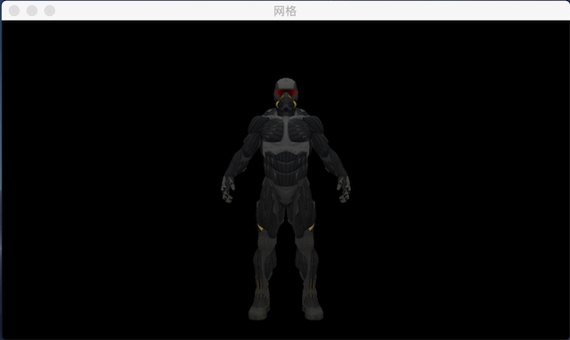

# OpenGL学习笔记

## 目录

* [窗口]<https://github.com/huxiaohei/OpenGL/tree/master/OpenGL_001>
* [第一个三角形]<https://github.com/huxiaohei/OpenGL/tree/master/OpenGL_002>
* [第一个正方形]<https://github.com/huxiaohei/OpenGL/tree/master/OpenGL_003>
* [着色器基础-in/out]<https://github.com/huxiaohei/OpenGL/tree/master/OpenGL_004>
* [着色器基础-uniform]<https://github.com/huxiaohei/OpenGL/tree/master/OpenGL_005>
* [着色器基础-location]<https://github.com/huxiaohei/OpenGL/tree/master/OpenGL_006>
* [多图形绘制]<https://github.com/huxiaohei/OpenGL/tree/master/OpenGL_007>
* [绘制一张图片]<https://github.com/huxiaohei/OpenGL/tree/master/OpenGL_008>
* [着色器子程序]<https://github.com/huxiaohei/OpenGL/tree/master/OpenGL_009>
* [封装着色器对象]<https://github.com/huxiaohei/OpenGL/tree/master/OpenGL_010>
* [OpenGL缓存数据]<https://github.com/huxiaohei/OpenGL/tree/master/OpenGL_011>
* [OpenGL基本绘制命令]<https://github.com/huxiaohei/OpenGL/tree/master/OpenGL_012>
* [OpenGL多实例渲染]<https://github.com/huxiaohei/OpenGL/tree/master/OpenGL_013>
* [变换-位移/缩放/旋转]<https://github.com/huxiaohei/OpenGL/tree/master/OpenGL_014>
* [一个片段着色器中设置多纹理]<https://github.com/huxiaohei/OpenGL/tree/master/OpenGL_015>
* [进入3D--坐标系统--透视]<https://github.com/huxiaohei/OpenGL/tree/master/OpenGL_016>
* [进入3D--坐标系统--立方体]<https://github.com/huxiaohei/OpenGL/tree/master/OpenGL_017>
* [进入3D--坐标系统--多个立方体]<https://github.com/huxiaohei/OpenGL/tree/master/OpenGL_018>
* [进入3D--摄像机--旋转]<https://github.com/huxiaohei/OpenGL/tree/master/OpenGL_019>
* [进入3D--摄像机--移动]<https://github.com/huxiaohei/OpenGL/tree/master/OpenGL_020>
* [进入3D--摄像机--鼠标控制视角移动]<https://github.com/huxiaohei/OpenGL/tree/master/OpenGL_021>
* [光照--颜色]<https://github.com/huxiaohei/OpenGL/tree/master/OpenGL_022>
* [光照--冯氏光照模型]<https://github.com/huxiaohei/OpenGL/tree/master/OpenGL_023>
* [光照--冯氏光照模型--材质]<https://github.com/huxiaohei/OpenGL/tree/master/OpenGL_024>
* [光照贴图]<https://github.com/huxiaohei/OpenGL/tree/master/OpenGL_025>
* [平行光]<https://github.com/huxiaohei/OpenGL/tree/master/OpenGL_026>
* [点光源]<https://github.com/huxiaohei/OpenGL/tree/master/OpenGL_027>
* [聚光]<https://github.com/huxiaohei/OpenGL/tree/master/OpenGL_028>
* [聚光软化边缘]<https://github.com/huxiaohei/OpenGL/tree/master/OpenGL_029>
* [多光源]<https://github.com/huxiaohei/OpenGL/tree/master/OpenGL_030>
* [模型]<https://github.com/huxiaohei/OpenGL/tree/master/OpenGL_031>
    
* [模型--光照]<https://github.com/huxiaohei/OpenGL/tree/master/OpenGL_032>
    
* [深度测试]<https://github.com/huxiaohei/OpenGL/tree/master/OpenGL_033>
* [模版测试]<https://github.com/huxiaohei/OpenGL/tree/master/OpenGL_034>
* [渲染带透明区域的图片]<https://github.com/huxiaohei/OpenGL/tree/master/OpenGL_035>
* [渲染半透明纹理]<https://github.com/huxiaohei/OpenGL/tree/master/OpenGL_036>
* [面剔除]<https://github.com/huxiaohei/OpenGL/tree/master/OpenGL_037>
* [离屏渲染]]<https://github.com/huxiaohei/OpenGL/tree/master/OpenGL_038>
* [后期处理-反相/灰度/核效果]]<https://github.com/huxiaohei/OpenGL/tree/master/OpenGL_039>
* [天空盒子]<https://github.com/huxiaohei/OpenGL/tree/master/OpenGL_040>
* [反射]<https://github.com/huxiaohei/OpenGL/tree/master/OpenGL_041>
* [几何着色器]<https://github.com/huxiaohei/OpenGL/tree/master/OpenGL_042>
